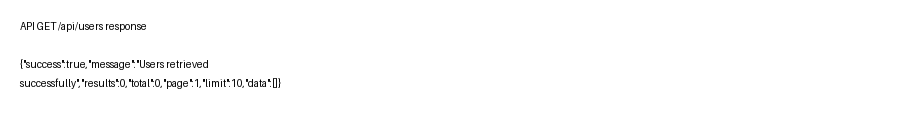

# User Management API

[](https://nodejs.org/)
[](https://expressjs.com/)
[](https://www.mongodb.com/cloud/atlas)
[](LICENSE)
[]()

A production-ready RESTful User Management API built with Node.js, Express, and MongoDB Atlas. Designed for internship submissions, recruiter reviews, and portfolio demonstrations. Includes validation, centralized error handling, pagination, search, sorting, security middleware, request logging, and a clean folder structure.

---

## Screenshots

- Server Running: 
- MongoDB Connected: 
- Create User (sample): 
- Get Users (sample): 
- Update User (sample): 
- Delete User (sample): 

---

## Features

- Full CRUD for User resources (Create, Read, Update, Delete)
- Input validation using `express-validator`
- Centralized error handling middleware
- Pagination, search, sorting, and filtering support
- MongoDB Atlas integration via Mongoose
- Security: `helmet`, `cors`, and rate limiting
- Request logging with `morgan`
- Environment variable configuration
- Clean, modular project structure (controllers, routes, models, middleware)
- Postman collection for manual testing

## Tech Stack

| Layer | Technology |
|---|---|
| Runtime | Node.js |
| Framework | Express.js |
| Database | MongoDB Atlas (Mongoose) |
| Validation | express-validator |
| Security | helmet, cors, express-rate-limit |
| Logging | morgan |
| Testing / Manual | Postman |

## Project Structure

```
incode vison
├── .env
├── .gitignore
├── package.json
├── README.md
├── users-api.postman_collection.json
├── screenshots/
│   ├── env.png
│   ├── server-status.png
│   ├── api-response.png
│   ├── get-users.png
│   ├── update-user.png
│   └── delete-user.png
├── scripts/
│   ├── generate_screenshots.py
│   └── generate_more_screenshots.py
├── src/
│   ├── server.js
│   ├── app.js
│   ├── config/
│   │   └── db.js
│   ├── controllers/
│   │   └── userController.js
│   ├── models/
│   │   └── User.js
│   ├── routes/
│   │   └── userRoutes.js
│   ├── validators/
│   │   └── userValidator.js
│   ├── middleware/
│   │   ├── errorMiddleware.js
│   │   └── validateMiddleware.js
│   └── utils/
│       └── apiFeatures.js
└── tests/
    ├── run_tests.js
    └── *.json
```

## Installation

1. Clone the repo:
```bash
git clone https://github.com/Sahil-TRCAC/user-management-api.git
cd user-management-api
```

2. Install dependencies:
```bash
npm install
```

3. Create a `.env` file (see Environment Variables section).

4. Run in development:
```bash
npm run dev
```

## Environment Variables

Create a `.env` file in the project root with the following variables:

| Variable | Description | Example |
|---|---:|---|
| `PORT` | Port the server listens on | `5001` |
| `MONGO_URI` | MongoDB Atlas connection string | `mongodb+srv://<user>:<password>@cluster0.mongodb.net/users-api?retryWrites=true&w=majority` |

> Note: Do not commit `.env` to version control. Rotate secrets before publishing.

## Running the Project

- Install:
```bash
npm install
```

- Start in development (nodemon):
```bash
npm run dev
```

- Start in production:
```bash
npm start
```

The API defaults to `http://localhost:<PORT>/api/users`.

## API Endpoints

| Method | Endpoint | Description |
|---|---|---|
| GET | /api/users | Get paginated list of users (with search/sort/filter) |
| GET | /api/users/:id | Get a single user by ID |
| POST | /api/users | Create a new user |
| PUT | /api/users/:id | Update a user |
| DELETE | /api/users/:id | Delete a user |

## Request Examples

Create user (POST):
```bash
curl -X POST http://localhost:5001/api/users \
  -H "Content-Type: application/json" \
  -d '{
    "firstName": "Alice",
    "lastName": "Smith",
    "email": "alice@example.com",
    "age": 30,
    "role": "user"
  }'
```

Get all users (GET):
```bash
curl "http://localhost:5001/api/users"
```

Get with pagination/search/sort:
```bash
curl "http://localhost:5001/api/users?page=1&limit=10&search=alice&sort=-createdAt"
```

## Response Examples

Successful create (201):
```json
{
  "success": true,
  "message": "User created successfully",
  "data": { /* user object */ }
}
```

Get all (200):
```json
{
  "success": true,
  "message": "Users retrieved successfully",
  "results": 1,
  "total": 1,
  "page": 1,
  "limit": 10,
  "data": [ /* users */ ]
}
```

Update (200):
```json
{
  "success": true,
  "message": "User updated successfully",
  "data": { /* updated user */ }
}
```

Delete (200):
```json
{
  "success": true,
  "message": "User deleted successfully"
}
```

## Validation Rules

- `firstName` — required, string, trimmed, min length 2
- `lastName` — required, string, trimmed, min length 2
- `email` — required, valid email format, unique
- `age` — optional, integer, positive
- `role` — optional, string, one of "user", "admin"

## Pagination, Search & Sorting

Supported query parameters on `GET /api/users`:

- `page` — page number (default: 1)
- `limit` — items per page (default: 10)
- `search` — free-text search applied to `firstName`, `lastName`, `email`
- `sort` — comma-separated fields, prefix with `-` for descending (example: `sort=-createdAt,email`)

Examples:
- Pagination: `GET /api/users?page=2&limit=20`
- Search: `GET /api/users?search=john`
- Sort: `GET /api/users?sort=createdAt`

## Error Handling

Errors follow a consistent structure:

```json
{
  "success": false,
  "message": "Validation failed",
  "errors": [
    { "field": "email", "message": "Email is invalid" }
  ]
}
```

## Security Features

- `helmet`: sets secure HTTP headers
- `express-rate-limit`: protects from brute-force / DoS by limiting requests (configurable)
- `cors`: restricts cross-origin access (configure allowed origins)
- Input validation: prevents malformed data and basic injection attempts

## Testing

- Manual testing: Use the provided `users-api.postman_collection.json` to import into Postman and exercise all endpoints.
- Automated tests: A basic test runner (`tests/run_tests.js`) exists to perform a full create → read → update → delete flow and save JSON responses to `tests/`.

## Future Improvements

- JWT Authentication and refresh tokens
- Role-Based Access Control (RBAC)
- Swagger / OpenAPI documentation
- Dockerfile and Docker Compose for containerized deployment
- Unit and integration tests (Jest / SuperTest)
- CI/CD pipeline (GitHub Actions) for automated tests and linting

## License

MIT License